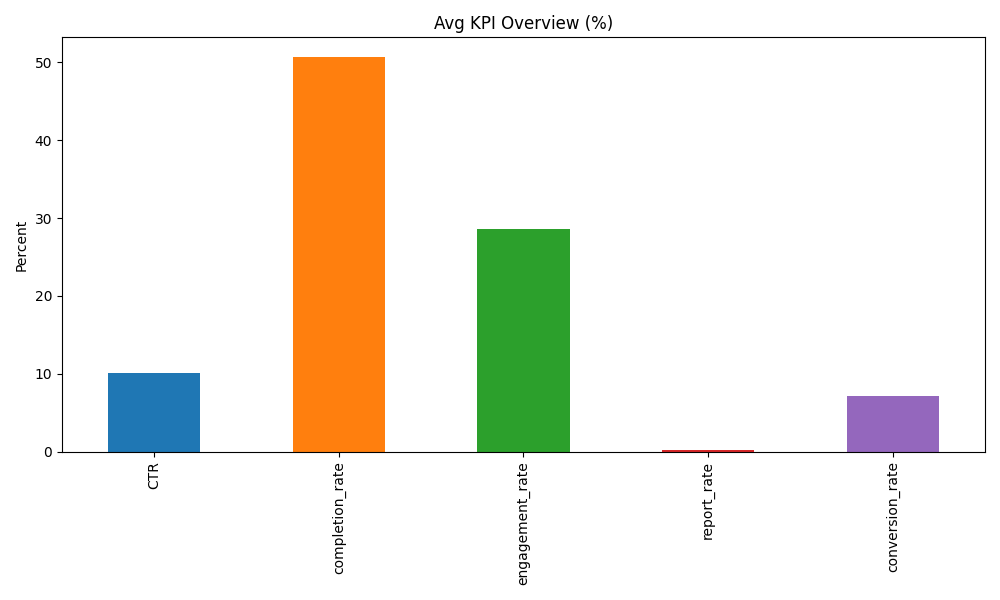
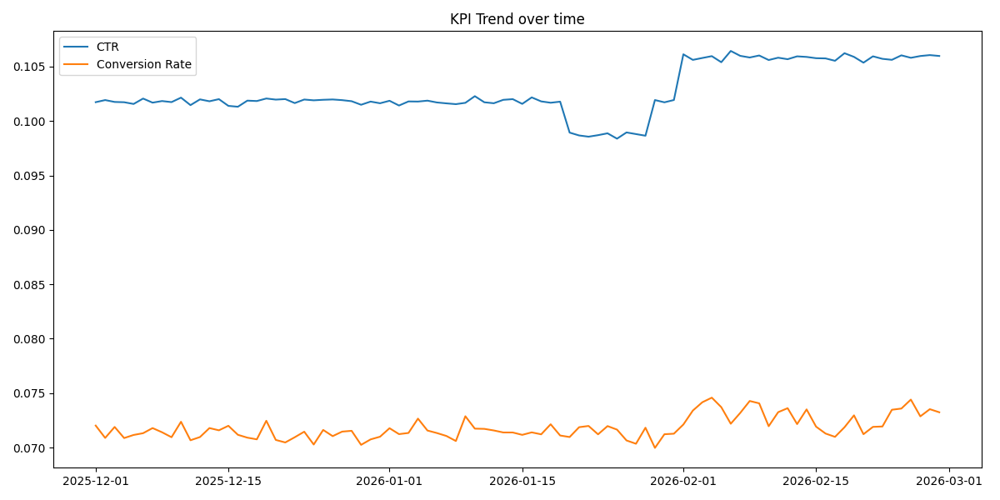
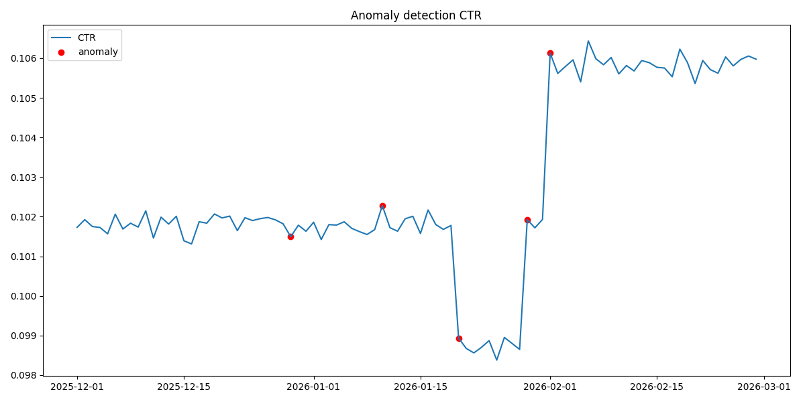
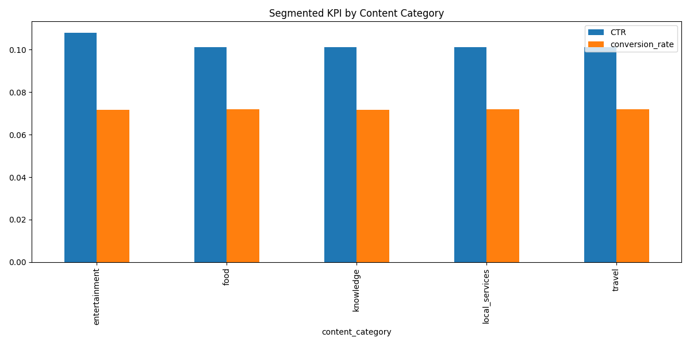
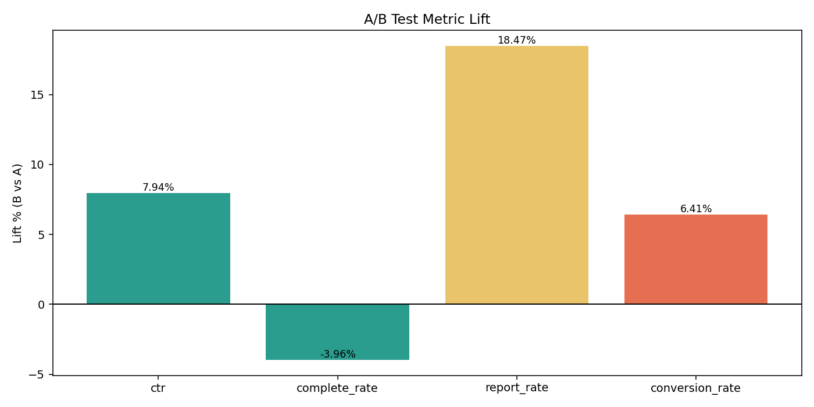
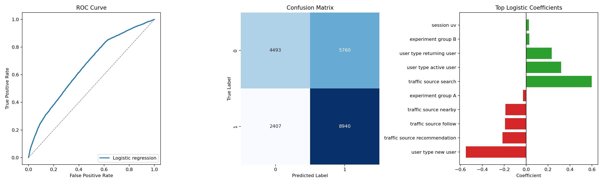
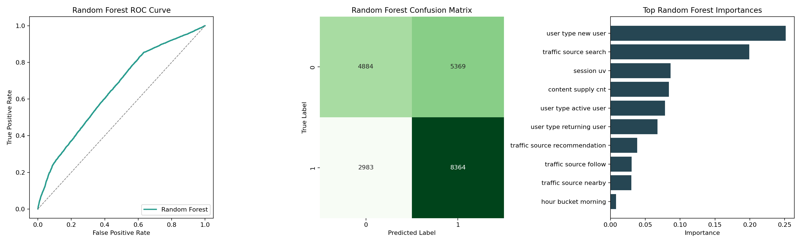
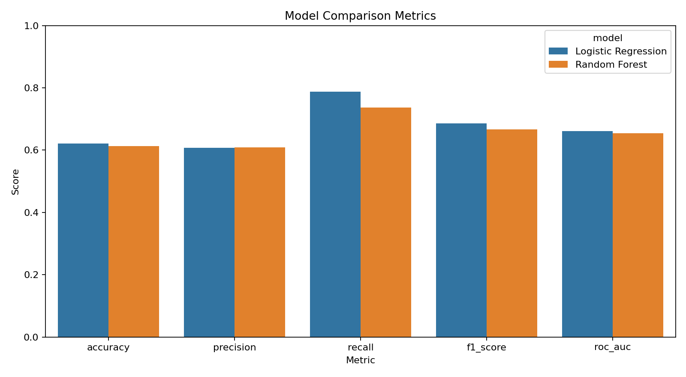
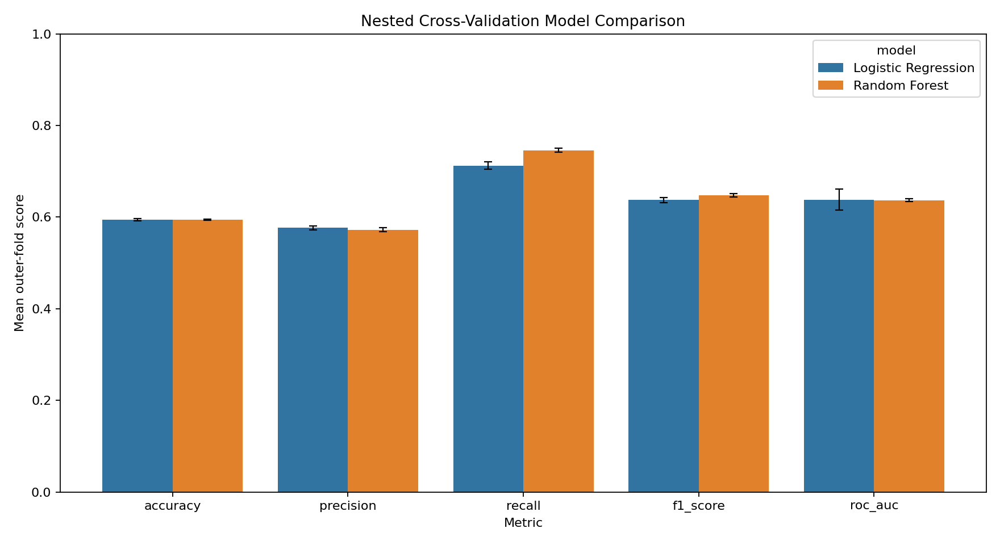

# Data-Driven Decision Support for Evaluating AI-Generated Advertising Content in a Simulated Content Platform

## Authors and Team
Rui Xu

## 1. Executive Summary
This project builds a simulated analytics and decision-support prototype for evaluating AI-generated advertising content on a content platform. The main business decision is how to monitor content and traffic performance, detect abnormal KPI changes, diagnose possible drivers, compare experiment groups, and estimate which segment-level contexts are more likely to produce high conversion performance.

The business value is not a final deployed strategy. It is a reusable workflow that shows how a platform team could combine descriptive, diagnostic, experimental, and initial predictive analytics to support better decisions. The source data is simulated platform data, so all results should be interpreted as prototype evidence for an analytics process rather than proof of real-world business impact.

The most important final progress is the addition of predictive modeling and improved validation. The project now includes an initial Logistic Regression prototype, factor-level coefficient interpretation, a Random Forest benchmark, and a nested cross-validation workflow that tunes hyperparameters and performs feature selection inside the validation process.

### Visual Roadmap

| Layer | Implemented Component | Purpose | Current Status |
|---|---|---|---|
| Descriptive analytics | KPI monitoring | Track platform health and core funnel performance | Completed |
| Diagnostic analytics | Anomaly detection and segmented diagnosis | Explain abnormal KPI changes by segment | Completed |
| Experimental analytics | Simulated A/B evaluation | Compare variants and business tradeoffs | Completed |
| Predictive analytics | Logistic Regression, Random Forest, nested CV | Estimate high-conversion likelihood and compare models fairly | Prototype completed |

## 2. Data Description and Preprocessing
The project uses `data/raw/content_platform_mock_data.csv` as the source dataset. Each row represents a simulated platform observation with time, content, traffic, user, experiment, and performance fields. The dataset supports both the monitoring workflow and the predictive modeling workflow.

### Dataset Summary

| Item | Value |
|---|---:|
| Observations | 97,200 |
| Variables | 20 |
| Numeric variables | 12 |
| Categorical variables | 8 |
| Time variables | 1 |
| Missing values | 0 |
| Duplicate rows | 0 |

Source table: [dataset_summary.csv](outputs/dataset_summary.csv)

### Variable Groups

| Group | Count | Examples |
|---|---:|---|
| Time | 1 | date |
| Categorical | 8 | week_day, hour_bucket, content_category, traffic_source, user_type, city_tier, experiment_group |
| Numeric | 12 | exposure, click, conversion_cnt, report_cnt, monetization_revenue, session_uv |

Source table: [variable_categories.csv](outputs/variable_categories.csv)

### Cleaning and Validity Checks

| Check | Result | Interpretation |
|---|---:|---|
| Missing values | 0 | The simulated dataset is complete for this workflow. |
| Duplicate rows | 0 | No duplicate row cleanup was required. |
| KPI validity | Checked through derived KPI calculations | Funnel and rate measures are suitable for monitoring. |
| Outlier and anomaly checks | Implemented through monitoring scripts | Unusual KPI movements are flagged for follow-up diagnosis. |

Detailed missing-value table: [missing_values.csv](outputs/missing_values.csv)

The project derives KPI ratios such as click-through rate, conversion rate, completion rate, interaction rate, report rate, and revenue-related measures from the simulated count fields. The anomaly workflow uses baseline and threshold-style logic to identify unusual changes. These checks help keep the dashboard and report focused on interpretable platform behavior instead of raw data dumps.

## 3. Descriptive Analytics and Dashboard Workflow
The first analytics layer is descriptive and diagnostic. It gives the project a monitoring backbone before moving into modeling.

### Figure 1. Dashboard Overview

This figure shows the dashboard-style view used to summarize the project workflow. It gives a compact view of platform KPIs and analysis modules rather than requiring users to inspect raw data or scripts. In business terms, this is the operating layer for quickly seeing whether the platform looks healthy and where deeper review may be needed.

### Figure 2. KPI Trend Monitoring

This figure shows how KPI monitoring is organized across time. Trend monitoring helps distinguish a temporary movement from a sustained performance pattern. For a platform team, this supports faster prioritization: a one-day spike may only need monitoring, while a repeated movement may need diagnosis.

### Figure 3. Anomaly Detection

This figure highlights abnormal KPI behavior detected by the monitoring workflow. The goal is not to automatically declare a root cause, but to flag when the system should trigger a closer review. In business terms, this acts like an early warning layer for conversion, engagement, or risk-related movement.

### Figure 4. Segmented Diagnosis

This figure supports root-cause style diagnosis by segment. The project reviews dimensions such as traffic source, user type, content category, and time bucket to identify which segments may be contributing to KPI changes. The result is a structured hypothesis list, not causal proof.

### Figure 5. Simulated A/B Evaluation

This figure compares simulated experiment groups on core performance metrics. The A/B module helps show how a platform team might compare conversion improvements while also considering guardrail metrics. Because the experiment is simulated, the figure should be presented as an evaluation design prototype rather than real deployed experiment evidence.

### KPI and A/B Summary Tables

| Metric | Value |
|---|---:|
| Exposure | 160,653,506 |
| Click | 16,508,371 |
| View complete | 8,372,511 |
| Conversion count | 1,185,990 |
| CTR | 0.1028 |
| Conversion rate | 0.0718 |

Source table: [kpi_summary.csv](outputs/kpi_summary.csv)

| Experiment group | Exposure | Click | Conversion count | CTR | Conversion rate |
|---|---:|---:|---:|---:|---:|
| A | 80,339,670 | 8,154,671 | 579,283 | 0.1015 | 0.0710 |
| B | 80,313,836 | 8,353,700 | 606,707 | 0.1040 | 0.0726 |

Source table: [ab_test_summary.csv](outputs/ab_test_summary.csv)

## 4. Predictive Modeling Prototype
Predictive modeling was added after the midterm to move the project beyond monitoring and diagnosis. The task is binary classification of `high_conversion_performance`, where a row is labeled positive if its conversion rate is at or above the training-set median threshold.

The initial Logistic Regression model uses a compact, presentation-friendly feature set: content category, traffic source, user type, city tier, experiment group, hour bucket, weekday, content supply count, session UV, and weekend indicator. Downstream leakage variables are excluded from the predictive feature matrix, including click, conversion count, view completion count, report count, monetization revenue, and direct outcome-rate variables.

### Figure 6. Initial Logistic Regression Predictive Results

The ROC curve shows the model's discrimination ability across classification thresholds. The confusion matrix shows correct and incorrect classifications at one operating threshold. The coefficient panel shows the most important positive and negative directional associations in the Logistic Regression model.

Initial Logistic Regression metrics:

| Metric | Value |
|---|---:|
| Accuracy | 0.6219 |
| Precision | 0.6082 |
| Recall | 0.7879 |
| F1-score | 0.6865 |
| ROC-AUC | 0.6606 |

Source table: [predictive_model_metrics.csv](outputs/predictive_model_metrics.csv)

The model captures some signal in the simulated data, especially for identifying many high-conversion rows. However, the result should be described as a lightweight prototype, not a production-ready model.

## 5. Factor-Level Interpretation
The coefficient chart is useful because it turns a predictive model into business language. Positive coefficients indicate higher predicted odds of high conversion performance relative to the encoded baseline or numeric scale. Negative coefficients indicate lower predicted odds. These are associations, not causal effects.

| Factor | Direction | Interpretation | Business Action |
|---|---|---|---|
| user type new user | Negative | New users appear less likely to reach high conversion performance, possibly because they have lower familiarity or trust. | Improve onboarding, simplify landing paths, and use lighter calls to action. |
| traffic source recommendation | Negative | Recommendation traffic may be more discovery-oriented than intent-oriented. | Separate engagement goals from conversion goals in recommendation placements. |
| traffic source follow | Negative | Follow-feed behavior may be relationship-based and less responsive to inserted ad content. | Test more native or creator-aligned ad formats. |
| traffic source nearby | Negative | Nearby traffic may reflect casual local browsing with uneven conversion intent. | Use stronger local relevance and category matching. |
| experiment group A | Slightly negative | Group A is slightly below the comparison context in the model. | Treat it as a baseline and compare against Group B and guardrail metrics. |
| traffic source search | Positive | Search traffic likely reflects stronger user intent. | Prioritize high-intent ad matching and landing-page quality for search sessions. |
| user type active user | Positive | Active users may have stronger platform habits and more stable response behavior. | Use active-user segments for controlled optimization tests. |
| user type returning user | Positive | Returning users may be more familiar and conversion-ready than new users. | Use continuity messaging and retargeting-style creative. |
| experiment group B | Slightly positive | Group B shows a small positive association with high conversion performance. | Review as a candidate variant, but keep guardrails in the decision. |
| session uv | Positive | Higher session volume may indicate healthier demand or stronger segment activity. | Monitor high-volume segments because small improvements can matter operationally. |

The strongest business message is that high-intent and established-user contexts look more favorable in this simulated model, while new-user and discovery-feed contexts look less conversion-ready. The caution is important: simulated coefficients should guide questions and hypotheses, not final business decisions.

## 6. Model Comparison: Logistic Regression vs Random Forest
Random Forest was added as a benchmark because it can capture nonlinear patterns and feature interactions. The comparison uses the same predictive task and a comparable feature setup.

### Figure 7. Random Forest Predictive Results

This figure summarizes the Random Forest model's classification behavior and feature-importance style output. It is useful as a flexible benchmark, but its feature importances are less direct to explain than Logistic Regression coefficients.

### Figure 8. Initial Model Comparison

This figure compares Logistic Regression and Random Forest on the same initial predictive task. It shows that Logistic Regression is slightly stronger on ROC-AUC and F1-score in the initial split, while Random Forest remains close enough to be a useful benchmark.

| Model | Accuracy | Precision | Recall | F1-score | ROC-AUC |
|---|---:|---:|---:|---:|---:|
| Logistic Regression | 0.6219 | 0.6082 | 0.7879 | 0.6865 | 0.6606 |
| Random Forest | 0.6133 | 0.6090 | 0.7371 | 0.6670 | 0.6536 |

Source table: [model_comparison_metrics.csv](outputs/model_comparison_metrics.csv)

Logistic Regression is slightly stronger and easier to explain in the initial split. Random Forest is useful because it checks whether a more flexible nonlinear model clearly improves performance. In this simulated project, it does not clearly outperform the simpler model, so the result is best framed as a comparison rather than a model-selection proof.

## 7. Improved Validation: Nested Cross-Validation
This section addresses the professor's feedback about better training and test logic. The earlier simple train/test comparison was an initial baseline. The nested cross-validation workflow is more rigorous because model tuning and feature selection happen inside the validation process.

Outer cross-validation estimates generalization performance. Inner cross-validation selects hyperparameters and feature-selection settings. `SelectKBest` is included inside the scikit-learn pipeline, so feature selection is fit only on training folds. The high-conversion target threshold is also computed only from each outer training fold, which avoids using held-out fold information to define the target.

### Figure 9. Nested Cross-Validation Model Comparison

This figure summarizes model performance under the nested CV workflow. It is the strongest validation figure in the report because it compares Logistic Regression and Random Forest using the same outer folds and an inner tuning loop. In business terms, it makes the predictive comparison more credible, even though the data is still simulated.

Nested CV setup:

| Component | Setup |
|---|---|
| Outer CV | 3 shuffled KFold folds |
| Inner CV | 3 StratifiedKFold folds |
| Shared outer folds | Same outer folds for Logistic Regression and Random Forest |
| Inner tuning metric | ROC-AUC |
| Feature selection | SelectKBest inside the pipeline |
| Target threshold | Computed only from each outer training fold |

Best hyperparameters:

| Model | Best setting |
|---|---|
| Logistic Regression | C=0.1, penalty=l1, SelectKBest k=10 |
| Random Forest | n_estimators=80, max_depth=8, min_samples_leaf=20, max_features=sqrt, SelectKBest k=all |

Nested CV average metrics:

| Model | Accuracy | Precision | Recall | F1-score | ROC-AUC |
|---|---:|---:|---:|---:|---:|
| Logistic Regression | 0.5940 | 0.5767 | 0.7126 | 0.6372 | 0.6383 |
| Random Forest | 0.5939 | 0.5724 | 0.7458 | 0.6477 | 0.6367 |

Source table: [nested_cv_model_comparison_metrics.csv](outputs/nested_cv_model_comparison_metrics.csv)

The nested CV result is a tradeoff. Logistic Regression has slightly better ROC-AUC. Random Forest has slightly better recall and F1-score. The overall difference is small, so there is no single definitive winner. The main improvement is validation rigor, not a dramatic metric increase.

## 8. Source Code and Repository Structure
GitHub repository: https://github.com/xur-2002/project

| Path | Purpose |
|---|---|
| `src/lightweight_predictive_model.py` | Initial Logistic Regression predictive prototype |
| `src/predictive_factor_analysis.py` | Factor interpretation and supporting summaries |
| `src/random_forest_predictive_model.py` | Random Forest benchmark model |
| `src/nested_cv_model_comparison.py` | Nested cross-validation comparison workflow |
| `src/anomaly_detection.py` | KPI anomaly detection |
| `src/root_cause_analysis.py` | Segmented diagnosis workflow |
| `src/ab_test_analysis.py` | Simulated A/B evaluation |
| `dashboard/app.py` | Streamlit dashboard prototype |

| Folder | Contents |
|---|---|
| `reports/outputs/` | Metrics CSVs, summaries, supporting tables, and asset indexes |
| `reports/figures/` | Dashboard, KPI, anomaly, A/B, predictive, and nested CV figures |
| `reports/tables/` | Earlier analysis summary tables |

## 9. Limitations
The dataset is simulated, so the project does not prove real-world business impact. It demonstrates a decision-support workflow that could be adapted to real platform data.

The A/B evaluation module is simulated and should not be presented as a real deployed experiment. The predictive models are prototypes. Logistic Regression coefficients show association, not causation. Random Forest feature importance is also descriptive, not causal.

Nested cross-validation improves validation quality, but it does not remove the limitations of simulated data. Future work would need real platform data, external validation, and stronger business guardrail review before any production use.

## 10. Next Steps
The next step is final presentation preparation. The story should focus on the progression from monitoring and diagnosis to predictive modeling and stronger validation.

Recommended next steps:

1. Select the final slide figures from this visual report.
2. Keep the nested CV section concise and frame it as a validation improvement.
3. Refine the predictive task only if better real or simulated labels become available.
4. Improve model features only if they remain leakage-safe and business meaningful.
5. Clean documentation so the final report, scripts, outputs, and figures tell the same story.

## 11. Conclusion
The project now includes descriptive analytics, diagnostic analytics, simulated experimental evaluation, and initial predictive analytics. The visual dashboard and figures make the monitoring workflow easier to communicate. The predictive modeling layer adds business-facing model interpretation and model comparison.

The nested cross-validation update makes the model comparison more rigorous by tuning hyperparameters and selecting features inside the validation process. Overall, the project has moved from monitoring-only toward a more complete simulated decision-support workflow for evaluating AI-generated advertising content.
